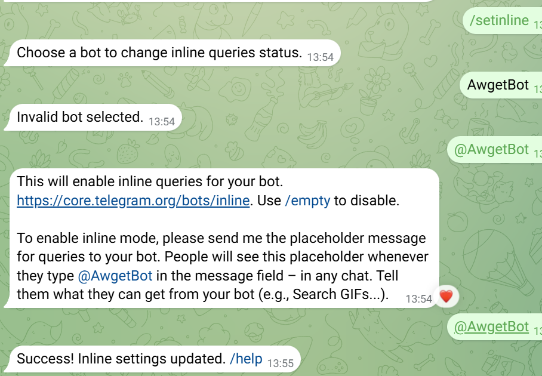
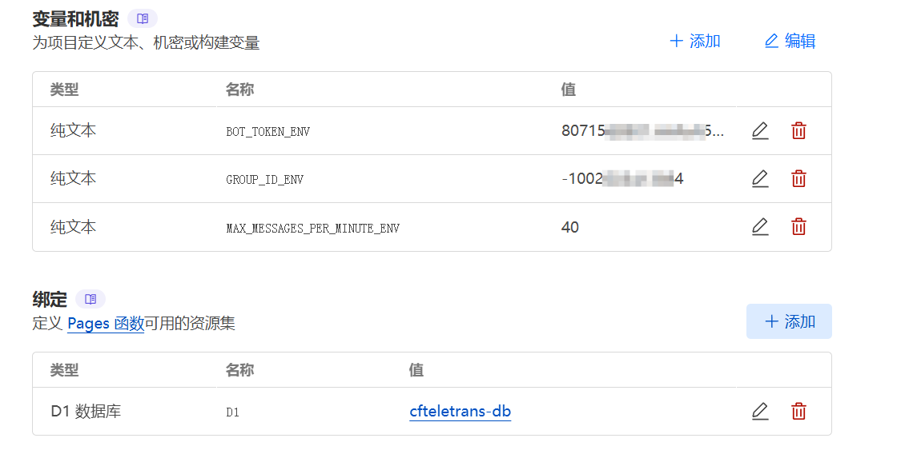

# CFTeleTrans (CTT) - Telegram消息转发分组对话机器人（基于Cloudflare）

这是一个基于Cloudflare Workers实现的Telegram消息转发分组对话机器人，代号 **CFTeleTrans (CTT)**，专注于将用户消息安全、高效地转发到后台群组，同时充分利用Cloudflare的免费额度（榨干CF大善人！）。该机器人支持用户验证、消息转发、频率限制、管理员管理等功能，适用于客服、社区管理等场景。

## 项目截图

以下是 CFTeleTrans 项目的截图： 

## 特点与亮点

1. **充分利用Cloudflare免费额度（榨干CF大善人！）**  
   - **CFTeleTrans (CTT)** 完全基于Cloudflare Workers部署，利用其免费额度（每天10万次请求，50次/分钟）实现高性能、低成本的机器人运行。
   - **使用Cloudflare D1存储用户状态和数据，免费额度（每天10万次读/写）足以支持中小规模用户群。**
   - 避免用别人的，受他人控制，（避免了突然植入广告，触不及防）该项目完全开源自己所有，可以自由修改代码的机器人
   - 零成本运行，适合个人开发者或小型团队，真正做到“榨干CF大善人”的免费资源！

2. **分组对话消息管理**  
   - 用户消息自动转发到后台群组的子论坛，别人私聊你机器人就如同添加了你好友，。
   - 群聊可多个号回复用户（只需将你的号拉进群并设置管理）
   - 置顶消息显示用户信息（昵称、用户名、UserID、发起时间）及通知内容
   - 每个用户独立一个分组，随时随地想聊就聊！
  
3. **高效的用户验证机制**  
   - 支持按钮式验证码验证（简单数学题），防止机器人刷消息。
   - 验证状态持久化（1小时有效期），用户验证通过后无需重复验证，除非触发频率限制。
   - 删除聊天记录后重新开始，验证码会自动触发，确保用户体验流畅。

4. **消息频率限制（防刷保护）**  
   - 默认每分钟40条消息上限（可通过环境变量调整），超过限制的用户需重新验证。
   - 有效防止恶意刷消息，保护后台群组和cf免费额度。

5. **管理员功能**  
   - 支持管理员命令：`/block`（拉黑用户）、`/unblock`（解除拉黑）、`/checkblock`（检查用户是否在黑名单）。
   - 管理员可通过后台群组直接回复用户消息，消息会转发到用户私聊。

6. **轻量级部署**  
   - 单文件部署（仅需一个`_worker.js`），代码简洁，易于维护。
   - 支持Cloudflare Workers和Cloudflare Pages部署，部署过程简单。

## 部署教程

### 准备工作
1. **创建Telegram Bot**：
   - 在Telegram中找到`@BotFather`，发送`/newbot`创建新机器人。
   - 按照提示设置机器人名称和用户名，获取Bot Token（例如`123456:ABC-DEF1234ghIkl-zyx57W2v1u123ew11`）。
   - 发送`/setinline`切换内联模式。

2. **创建后台群组**：
   - 创建一个Telegram群组（按需设置是否公开），
   - 群组的“话题功能”打开。
   - 添加机器人为管理员，建议权限全给（消息管理，话题管理）
   - 获取群组的Chat ID（例如`-100123456789`），可以通过`@getidsbot`获取（拉它进群）。

### 部署到Cloudflare Workers

#### 步骤 1：创建D1 SQL数据库
1. 登录[Cloudflare仪表板](https://dash.cloudflare.com/)。
2. 导航到 **存储和数据库 > D1 SQL数据库**，输入一个名称（例如`cfteletrans-db`），点击 **创建**。

#### 步骤 2：创建Workers项目
1. 登录[Cloudflare仪表板](https://dash.cloudflare.com/)。
2. 导航到 **Workers和Pages > Workers和Pages**，点击 **创建**。
3. 点击 **Hello world**，输入一个名称（例如`cfteletrans`），再点击 **部署**

#### 步骤 3：配置环境变量
1. 在创建的Workers项目 **设置 > 变量和机密** 中，添加以下变量：
- `BOT_TOKEN_ENV`：您的Telegram Bot Token（例如`123456:ABC-DEF1234ghIkl-zyx57W2v1u123ew11`）。
- `GROUP_ID_ENV`：后台群组的Chat ID（例如`-100123456789`）。
- `MAX_MESSAGES_PER_MINUTE_ENV`：消息频率限制（例如`40`）。

#### 步骤 4：绑定D1 SQL数据库
1. 在创建的Workers项目 **设置 > 绑定** 中，绑定数据库：
- 添加-选择D1数据库
- 变量名称 `D1`
- D1 数据库 选择刚建的数据库（例如`cfteletrans-db`），
- 点击 **编辑代码**，把原来的代码用本项目中的_worker.js代码替换后部署

#### 步骤 5：测试
1. 在Telegram中找到您的机器人，发送`/start`。
2. 确认收到“你好，欢迎使用私聊机器人！”并触发验证码。
3. 完成验证，确认收到合并消息，例如：
4. 发送消息，确认消息转发到后台群组的子论坛。

## 需要在 Cloudflare 绑定的变量表

以下是项目中需要在 Cloudflare 环境中绑定的变量及其说明：

| **变量名**                  | **类型**   | **描述**                                                                 | **默认值/示例**            |
|-----------------------------|------------|--------------------------------------------------------------------------|----------------------------|
| `BOT_TOKEN_ENV`            | 环境变量   | Telegram Bot 的 Token，用于与 Telegram API 通信。                        | `your-telegram-bot-token`  |
| `GROUP_ID_ENV`             | 环境变量   | Telegram 群组的 ID，用于消息转发和客服回复。                             | `-123456789`               |
| `MAX_MESSAGES_PER_MINUTE_ENV` | 环境变量 | 每分钟允许的最大消息数，用于限制用户发送频率。                           | `40`                       |
| `D1`                       | D1 绑定    | Cloudflare D1 数据库绑定，用于存储用户状态、消息频率和群组映射。         | `cfteletrans-db`           |

### 部署到Cloudflare pages

#### **fork本项目**！！！

#### 步骤 1：创建pages项目
1. 登录[Cloudflare仪表板](https://dash.cloudflare.com/)。
2. 导航到 **Workers和Pages > Workers和Pages**，选择pages，点击 **创建**。
3. 连接GitHub部署（或者下载本项目zip部署）

#### 步骤 2：填写变量后重试部署

## 灵感来源
本项目的灵感来源于 Telegram-interactive-bot(部署在服务器)

- [Telegram-interactive-bot](https://github.com/MiHaKun/Telegram-interactive-bot)

## 参考文献

在开发过程中，以下资源提供了宝贵的参考和指导：

- [NodeSeek 帖子](https://www.nodeseek.com/post-237769-1)

## 致谢

- 特别感谢 [xAI](https://x.ai/) 提供的支持和灵感，帮助我完成了本项目的开发和优化
- 特别感谢 [cloud flare](https://www.cloudflare.com/) 大善人

## 贡献

欢迎提交 Issue 或 Pull Request！如果您有任何改进建议或新功能需求，请随时联系我。

## 许可证

本项目采用 MIT 许可证，详情请见 [LICENSE](LICENSE) 文件。

## 声明

- **尊重原创，转载须知**  
  如需转载，请务必注明出处，感谢支持！严禁将本项目用于任何违法犯罪行为。  
- **二次修改与发布**  
  欢迎基于本项目进行二次开发，但请在发布时注明原始出处，共同维护开源社区的良好氛围。
